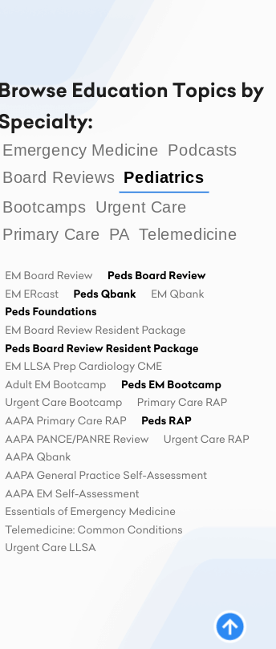
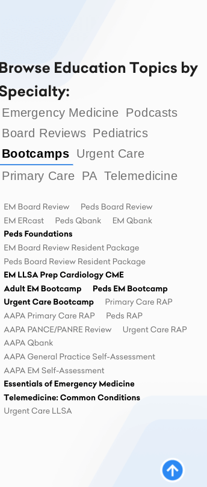
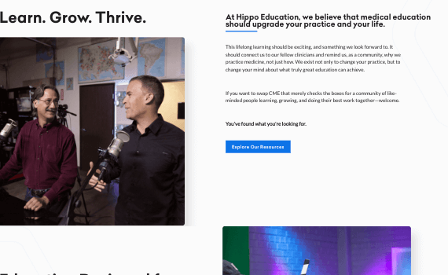

# Hippo React Frontend Developer Assessment

This is a solution to this [repo](https://github.com/HippoEducation/hippo-front-end-test).

## Screenshots 


***


***


***


***


***



***



***


***


***



***


***

## Tasks

Using the provided `create-react-app` application in this repo and the [Figma
designs](https://www.figma.com/file/YgIChNNRe3uchaOJTVMash/Hippo-Frontend-Dev-Test?node-id=0%3A1)
please complete the following tasks:

1. Implement the styling for the four main body content areas on the homepage.
   The text content has already been added to `App.tsx` in placeholder `<span>`
   tags for your convenience. The images can be found in `Homepage-Images.zip`,

   - Consider how these content blocks might be used on other pages in the site
     (e.g. product sales pages) and create React Components as appropriate.
   - Remember to implement the animations described in the 'Animation Note'

2. Complete the Topic Cloud styling & behavior

- Clicking an unselected Specialty should change which Topics are highlighted
- Remember to implement the selected and hover states for all items
- Remember to implement the animations described in the 'Animation Note'

For any details which are not clear from the designs, for example at what
size the layouts transition from stacked to side-by-side, or how the layouts
behave as the size grows, use your best judgement and feel free to explain
any choices you made and why.

## Browser Support

You should test your work in the latest version of Chrome. If you use any
features that are not supported any common browser or IE 11, you should
mention these features and how you _would_ provide a suitable fallback
experience if your code does not do so already.

## Environment

You can use any stable version of Node JS. The base project is written using
TypeScript but you may use vanilla JavaScript to complete the tasks.

## Coding Standard

Your styles should be responsive and mobile-first.

You are encouraged to use [BEM](http://getbem.com/introduction/) methodology
for CSS classnames if you are familiar with it. If you are not familiar with
BEM, you may use any naming strategy you like.

Please use [ESLint](https://eslint.org/) and [Prettier](https://prettier.io/)
for your code. The project is set up to lint your code using:

```sh
yarn lint
```

If your editor is not already configured to use Prettier, you can format code
in the project using:

```sh
yarn prettier-write
```

## Dependencies

Please use the [Yarn](https://yarnpkg.com/) tool for dependency management. You
can use any 3rd-party libraries as necessary or as desired in order to achieve
the tasks.

## Thoughts

- Didn't use yarn
- package-lock.json is honored by yarn -  should be no problems if user decides to use yarn - yarn.lock is also looked at during npm installations - but sub-dependencies aren't guaranteed to be included
- Deprecated packages of node-sass, typeface-lato, and @types/classnames removed
- Problems with original repo: missing photo from figma design (home3), missing background images, and prettier was a dependency versus being a dev dependency
- Tried to make this seem like it was coded by one person 
- Mixins file has a lot of unused code but I left it in 
- Since classnames was a dependency - took that as a hint - decided to try and use only one component for the 4 content sections and conditionally render changes with Classnames
- Could had made one component that covered 2 sections (3 & 4) and passed a prop to change row-reverse value.  
- Probably needed at least 2 components and passing multiple props for all the data.
- Using an array and a sectionData hook, you only need 1 component but it might be harder to style inside the passed data, i.e. adding a span for one word - need to use slice to manipulate the passed data
- Images converted to webp
- Ideally, you'd have multiple variants for different viewport sizes
- loading="lazy" and responsive-design conflict
- Intersection Observer for performance gains - thought about using it to load images for the image grid - add the srcs when scroll position is 200px from a ref on the image grid
- Typing refs is a hassle - need to investigate more
- Prefers-reduced-motion for animation - you cannot test prefer-reduced-motion on linux ?
- Since it is harder to manually test prefers-reduced-motion, I only added the animation code inside of the media query versus undoing it in a prefers-reduced-motion:reduce media query
- animation will run once - even if you have already scrolled past - refresh with scroll position past a ContentSection - unavoidable?
- home3 image on mobile doesn't look like it is full width, but it actually is - I exported the image from the figma file and it had the box-shadow and the white space.   
- It takes extra tweaking to make it full screen on mobile

## Useful Resources

- [FontSource](https://fontsource.org)
- [Stack Overflow](https://stackoverflow.com/questions/73667032/sass-use-does-not-work-in-css-modules-in-react-while-import-does) - sass use does not work - need to alias or * 
- [YouTube](https://www.youtube.com/watch?v=hWGgw1K-i8Y) - Spice up your site with shapes
- [YouTube](https://www.youtube.com/watch?v=-Crh4zFeQx8) - scroll indicator
- [Stack Overflow](https://stackoverflow.com/questions/69054825/how-should-i-implement-lazy-loading-for-my-images-in-react) - lazy loading
- [Blog](https://imagekit.io/blog/lazy-loading-images-complete-guide/) - lazy loading images
- [Google](https://developer.chrome.com/docs/lighthouse/performance/font-display/?utm_source=lighthouse&utm_medium=devtools) - font-display: swap
- [Stack Overflow](https://stackoverflow.com/questions/23416880/lazy-loading-with-responsive-images-unknown-height) - lazy loading with responsive images
- [YouTube](https://www.youtube.com/watch?v=r1auJEf9ISo) - intersection observer with react
- [CSS Tricks](https://css-tricks.com/books/greatest-css-tricks/scroll-animation/) - scroll animation
- [YouTube](https://www.youtube.com/watch?v=3yIFenltv0E) - aos tutorial 
- [CSS Tricks](https://css-tricks.com/aos-css-driven-scroll-animation-library/) - aos css drive scroll animation library
- [Blog](https://www.creative-tim.com/blog/web-design/create-scrolling-transformations-react-app/) - create scrolling transformations
- [Dev.to](https://dev.to/producthackers/intersection-observer-using-react-49ko) - intersection observer with react
- [html.am](https://www.html.am/html-codes/marquees/css-slide-in-text.cfm) - css slide-in text
- [Upmostly](https://upmostly.com/tutorials/react-onhover-event-handling-with-examples) - react onhover event handling
- [Github](https://github.com/thebuilder/react-intersection-observer/blob/HEAD/docs/Recipes.md#lazy-image-load) - react-intersection-observer package recipes
- [YouTube](https://www.youtube.com/watch?v=T33NN_pPeNI) - scroll animations
- [Stack Overflow](https://stackoverflow.com/questions/53684503/intersection-observer-call-a-function-only-once-per-element) - intersection observer call function only once
- [React Reveal](https://www.react-reveal.com/examples/common/slide/) - slide animation from react-reveal
- [Web.dev](https://web.dev/prefers-reduced-motion/#:~:text=The%20media%20query%20prefers%2Dreduced,in%20the%20underlying%20operating%20system.) - prefers-reduced-motion
- [Blog](https://www.bennadel.com/blog/4132-applying-multiple-animation-keyframes-to-support-prefers-reduced-motion-in-css.htm) - multiple animations based on prefers-reduced-motion
- [Blog](https://www.joshwcomeau.com/css/designing-shadows/) - designing shadows